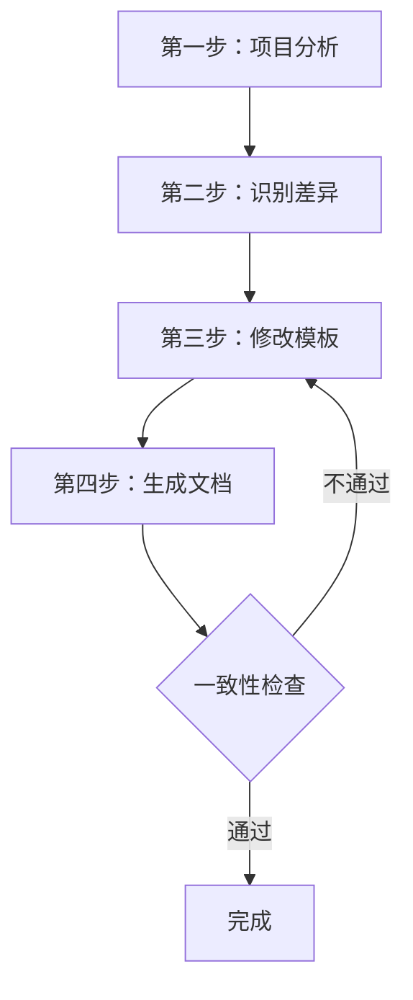

# 模板使用说明 - 强制适配项目

> ⚠️ **核心原则：模板服务于项目，项目优先于模板**
> 
> **当模板与项目冲突时，必须修改模板适配项目，绝不允许让项目适配模板！**

## 一、为什么需要适配？

### 1.1 常见问题

**❌ 错误做法（直接套用模板）：**

```
场景：现有项目使用 Express + Sequelize

AI 直接套用 NestJS + TypeORM 模板生成文档：

src/
└── modules/
    └── user/
        ├── user.module.ts         ← 项目根本没有 NestJS 模块
        ├── user.controller.ts     ← 项目使用 Express Router
        └── entities/user.entity.ts ← 项目使用 Sequelize Model
```

**结果：**
- 生成的代码与项目架构完全不符
- 无法直接运行，需要大量修改
- 破坏了项目的代码一致性
- 增加了维护成本

### 1.2 正确做法（修改模板适配项目）

**✅ 正确做法（先适配再使用）：**

```
步骤 1：分析项目实际架构
- 框架：Express (不是 NestJS)
- ORM: Sequelize (不是 TypeORM)
- 目录：controllers/services/models (不是 modules)

步骤 2：修改模板适配项目
- 将 NestJS Module 改为 Express Router
- 将 TypeORM Entity 改为 Sequelize Model
- 将 modules/ 目录改为 controllers/services/models/

步骤 3：使用适配后的模板生成文档
- 生成的代码与项目完全一致
- 可以直接运行
- 保持了代码一致性
- 易于维护
```

## 二、模板使用流程

### 2.1 标准流程（四步法）



### 第一步：项目分析

**运行技能分析项目：**

```bash
# 调用 ai-dev-assistant skill
# 执行 analyze-project 命令
```

**获取项目信息：**

| 维度 | 分析结果 |
|------|---------|
| **框架** | 【Express/NestJS/Koa】 |
| **ORM** | 【Sequelize/TypeORM/Prisma】 |
| **目录结构** | 【实际结构】 |
| **代码风格** | 【TS/JS，Options/Composition】 |
| **命名规范** | 【实际规范】 |

### 第二步：识别差异

**对比模板与项目的差异：**

| 维度 | 模板标准 | 项目实际 | 差异处理 |
|------|---------|---------|---------|
| **框架** | NestJS | Express | ✅ 需要适配 |
| **ORM** | TypeORM | Sequelize | ✅ 需要适配 |
| **目录** | modules/ | controllers/ | ✅ 需要适配 |
| **语言** | TypeScript | TypeScript | ✅ 一致 |

**标记需要适配的内容：**
- [x] 框架架构（NestJS → Express）
- [x] ORM 写法（TypeORM → Sequelize）
- [x] 目录结构（modules/ → controllers/）
- [ ] 语言（TypeScript，已一致）

### 第三步：修改模板

**根据差异识别结果，调整模板内容：**

#### 3.1 目录结构调整

**原模板（NestJS）：**
```
src/
└── modules/
    └── user/
        ├── user.module.ts
        ├── user.controller.ts
        └── user.service.ts
```

**修改后（Express）：**
```
src/
├── controllers/
│   └── user.controller.ts
├── services/
│   └── user.service.ts
└── models/
    └── user.model.ts
```

#### 3.2 ORM 写法调整

**原模板（TypeORM）：**
```typescript
@Entity('users')
export class User {
  @PrimaryGeneratedColumn('uuid')
  id: string

  @Column()
  name: string
}
```

**修改后（Sequelize）：**
```typescript
export class User extends Model {
  public id!: string
  public name!: string
}

User.init(
  {
    id: {
      type: DataTypes.UUID,
      defaultValue: DataTypes.UUIDV4,
      primaryKey: true,
    },
    name: {
      type: DataTypes.STRING,
      allowNull: false,
    },
  },
  {
    tableName: 'users',
    sequelize: app.db,
  }
)
```

#### 3.3 控制器风格调整

**原模板（NestJS）：**
```typescript
@Controller('api/users')
export class UsersController {
  constructor(private service: UsersService) {}

  @Post()
  create(@Body() dto: CreateUserDto) {
    return this.service.create(dto)
  }
}
```

**修改后（Express）：**
```typescript
const router = Router()

router.post('/', async (req, res) => {
  const user = await UsersController.create(req.body)
  res.json(user)
})

export default router
```

### 第四步：生成文档

**使用适配后的模板生成文档：**

```markdown
# 用户管理模块开发文档

## 一、项目分析结果

**项目实际架构：**
- 框架：Express 4.x
- ORM: Sequelize 6.x
- 目录：controllers/services/models

## 二、目录结构（已适配）

src/
├── controllers/
│   └── user.controller.ts
├── services/
│   └── user.service.ts
└── models/
    └── user.model.ts

## 三、Model 定义（Sequelize 写法）

【Sequelize Model 定义代码】

## 四、Controller 定义（Express 写法）

【Express Router 定义代码】
```

## 三、一致性检查清单

### 3.1 前端检查清单

**在生成文档前，必须完成以下检查：**

- [ ] **目录结构检查**：新增文件的目录位置是否与现有模块一致？
- [ ] **命名规范检查**：组件、文件、Store 的命名是否与现有代码一致？
- [ ] **组件风格检查**：Options API vs Composition API 是否一致？
- [ ] **状态管理检查**：Pinia vs Vuex 是否一致？
- [ ] **API 调用检查**：axios 实例、封装方式是否一致？
- [ ] **样式方案检查**：SCSS/Less/TailwindCSS 是否一致？
- [ ] **导入路径检查**：import 路径格式（@/vs ../）是否一致？
- [ ] **注释风格检查**：JSDoc/TSDoc 是否一致？

**如果有任一项不一致，必须返回第三步重新调整模板！**

### 3.2 后端检查清单

**在生成文档前，必须完成以下检查：**

- [ ] **目录结构检查**：新增文件的目录位置是否与现有模块一致？
- [ ] **命名规范检查**：Controller、Service、Model 的命名是否与现有代码一致？
- [ ] **框架架构检查**：NestJS vs Express vs Koa 是否一致？
- [ ] **ORM 写法检查**：TypeORM vs Prisma vs Sequelize 是否一致？
- [ ] **API 规范检查**：RESTful vs GraphQL vs gRPC 是否一致？
- [ ] **错误处理检查**：Exception Filters vs 中间件 vs try-catch 是否一致？
- [ ] **依赖注入检查**：DI Container vs 手动注入 vs 无 DI 是否一致？
- [ ] **注释风格检查**：JSDoc/TSDoc 是否一致？

**如果有任一项不一致，必须返回第三步重新调整模板！**

## 四、常见场景适配指南

### 4.1 场景 A：全新项目

**特点：**
- 没有历史包袱
- 可以使用最佳实践
- 模板标准结构通常适用

**适配策略：**
```
1. 直接使用模板的标准结构
2. 确认技术栈与模板一致
3. 如有不同，微调模板即可
```

**示例：**
```
项目：Vue 3 + Vite + Pinia + TypeScript
模板：标准 Vue 3 模板
适配：直接使用，无需大改
```

### 4.2 场景 B：二次开发

**特点：**
- 已有现有代码
- 必须保持一致性
- 不能破坏现有架构

**适配策略：**
```
1. 详细分析现有项目结构
2. 识别与模板的差异
3. 大幅修改模板适配项目
4. 严格进行一致性检查
```

**示例：**
```
项目：Vue 2 + Webpack + Vuex + JavaScript
模板：Vue 3 标准模板
适配：
  - 目录结构：保持项目现有 views/store/modules
  - 组件风格：从 Composition API 改为 Options API
  - 状态管理：从 Pinia 改为 Vuex
  - 语言：从 TypeScript 改为 JavaScript + JSDoc
```

### 4.3 场景 C：框架定制

**特点：**
- 基于框架（如 NestJS、Next.js）开发
- 框架有严格的目录规范
- 需要遵循框架的最佳实践

**适配策略：**
```
1. 优先遵循框架规范
2. 使用框架提供的扩展点
3. 避免修改框架核心代码
4. 在框架基础上微调
```

**示例：**
```
项目：NestJS + TypeORM
模板：标准 NestJS 模板
适配：
  - 目录结构：遵循 NestJS 标准 modules/
  - 模块定义：使用 @Module() 装饰器
  - 依赖注入：使用 NestJS DI Container
  - 扩展点：使用 Guards、Interceptors、Filters
```

## 五、适配示例

### 5.1 前端示例：Vue 2 项目适配

**项目分析：**
```
框架：Vue 2.7
构建：Webpack 5
状态管理：Vuex 4
UI 组件：Element Plus
代码风格：Options API + JavaScript
```

**模板适配过程：**

#### 步骤 1：识别差异

| 维度 | 模板标准 | 项目实际 | 适配动作 |
|------|---------|---------|---------|
| Vue 版本 | Vue 3 | Vue 2.7 | 改用 Options API |
| 状态管理 | Pinia | Vuex | 改用 Vuex Store |
| 语言 | TypeScript | JavaScript | 移除 TS，添加 JSDoc |
| 构建工具 | Vite | Webpack | 保持项目配置 |

#### 步骤 2：修改模板

**原模板（Vue 3 + Composition API）：**
```vue
<script setup>
import { ref, computed } from 'vue'
import { useStore } from 'pinia'

const store = useStore()
const count = ref(0)
const double = computed(() => count.value * 2)
</script>
```

**修改后（Vue 2 + Options API）：**
```vue
<script>
import { mapState } from 'vuex'

export default {
  name: 'ComponentName',
  data() {
    return {
      count: 0,
    }
  },
  computed: {
    ...mapState(['someState']),
    double() {
      return this.count * 2
    },
  },
  methods: {
    // 方法定义
  },
}
</script>
```

### 5.2 后端示例：Express 项目适配

**项目分析：**
```
框架：Express 4
ORM: Sequelize 6
API 规范：RESTful
代码风格：TypeScript
目录结构：controllers/services/models
```

**模板适配过程：**

#### 步骤 1：识别差异

| 维度 | 模板标准 | 项目实际 | 适配动作 |
|------|---------|---------|---------|
| 框架 | NestJS | Express | 改用 Router |
| ORM | TypeORM | Sequelize | 改用 Sequelize Model |
| 目录 | modules/ | controllers/ | 改用项目目录 |
| DI | NestJS DI | 手动注入 | 移除 DI 装饰器 |

#### 步骤 2：修改模板

**原模板（NestJS + TypeORM）：**
```typescript
// Controller
@Controller('api/users')
export class UsersController {
  constructor(private service: UsersService) {}

  @Get(':id')
  findOne(@Param('id') id: string) {
    return this.service.findOne(id)
  }
}

// Entity
@Entity('users')
export class User {
  @PrimaryGeneratedColumn('uuid')
  id: string

  @Column()
  name: string
}
```

**修改后（Express + Sequelize）：**
```typescript
// Router
const router = Router()

router.get('/:id', async (req, res) => {
  const user = await UsersService.findOne(req.params.id)
  res.json(user)
})

// Model
export class User extends Model {
  public id!: string
  public name!: string
}

User.init(
  {
    id: {
      type: DataTypes.UUID,
      defaultValue: DataTypes.UUIDV4,
      primaryKey: true,
    },
    name: {
      type: DataTypes.STRING,
      allowNull: false,
    },
  },
  {
    tableName: 'users',
    sequelize: app.db,
  }
)
```

## 六、注意事项

### 6.1 禁止行为

**❌ 绝对禁止：**

1. **直接套用模板**
   - 不分析项目就使用模板
   - 忽略项目实际架构

2. **修改项目适配模板**
   - 要求现有代码适应模板
   - 破坏项目一致性

3. **忽略一致性检查**
   - 不进行检查就生成文档
   - 明知不一致仍继续使用

### 6.2 必须行为

**✅ 必须做到：**

1. **先分析后使用**
   - 必须运行项目分析
   - 必须识别差异点

2. **修改模板适配**
   - 必须根据项目调整模板
   - 必须保持代码一致性

3. **严格检查**
   - 必须完成一致性检查
   - 必须确保可以运行

### 6.3 最佳实践

**💡 建议：**

1. **建立项目档案**
   - 记录项目的技术栈、架构、规范
   - 每次开发前查阅档案

2. **创建项目专用模板**
   - 基于标准模板创建项目适配版
   - 后续开发直接使用适配版

3. **持续优化**
   - 发现不一致及时修正
   - 积累经验改进模板

## 七、总结

### 核心原则

```
🎯 模板服务于项目，项目优先于模板

⚠️ 当模板与项目冲突时：
   - ✅ 修改模板适配项目
   - ❌ 绝不让项目适配模板
```

### 工作流程

```
1. 分析项目 → 2. 识别差异 → 3. 修改模板 → 4. 生成文档 → 5. 一致性检查
                                      ↑                              ↓
                                      └────── 不通过 ────────────────┘
```

### 成功标准

- ✅ 生成的代码可以直接运行
- ✅ 与现有代码风格一致
- ✅ 符合项目架构规范
- ✅ 易于维护和扩展

---

**记住：好的模板是灵活的，能够适应不同的项目，而不是让项目适应模板！**
